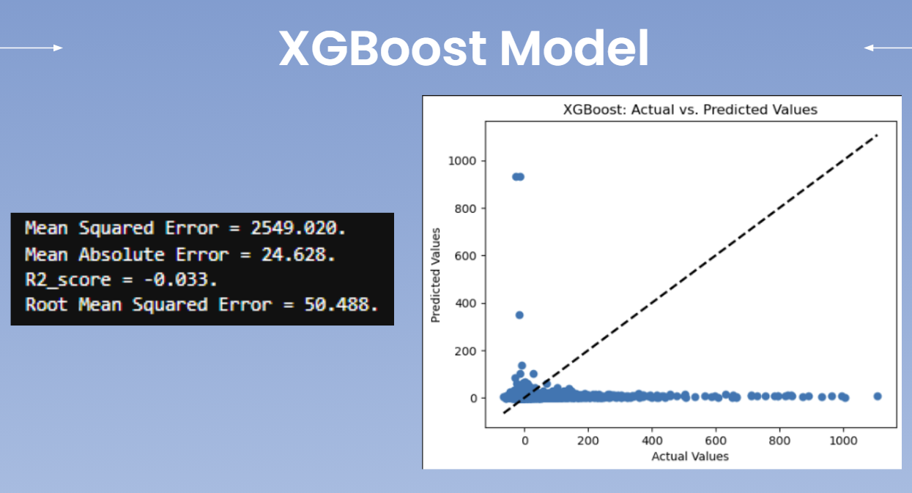

# Predicitng Flight Delays 🔮

## Project/Goals 🎯

The goal is to predict arrival delays of commercial flights. Often, there isn't much airlines can do to avoid the delays, therefore, they play an important role in both profits and loss of the airlines. It is critical for airlines to estimate flight delays as accurate as possible because the results can be applied to both, improvements in customer satisfaction and income of airline agencies.

## Files 📁

 - [`'data'`](https://github.com/Jaghs/flight-delay-prediction/tree/master/data): older contains datasets of commercial flights, passengers, and fuel consumption that were downloaded through SQL querying
 - [`'images'`](https://github.com/Jaghs/flight-delay-prediction/tree/master/images): folder contains important images from the workbooks
- [`'workbooks'`](https://github.com/Jaghs/demand-prediction-project/tree/main/src): folder contains 4 jupyter notebooks that were used to complete this project:

    1. [`'data_retrieval'`](https://github.com/Jaghs/flight-delay-prediction/blob/master/workbooks/data_retrieval.ipynb): this file contains the code that was used to query the SQL database with SQL Alchemy

    3. [`'data_prep'`](https://github.com/Jaghs/flight-delay-prediction/blob/master/workbooks/data_prep.ipynb): this file contains the cleaning of the datasets

    2. [`'exploratory_analysis'`](https://github.com/Jaghs/flight-delay-prediction/blob/master/workbooks/exploratory_analysis.ipynb): this file contains 10 questions we need to answer during the data exploration phase. They will help us to understand the data and become familiar with different variables

    3. [`'modeling'`](https://github.com/Jaghs/flight-delay-prediction/blob/master/workbooks/modeling.ipynb): this file contains instructions for modeling part of the project

- [`'data_description'`](https://github.com/Jaghs/flight-delay-prediction/blob/master/data_description.md): when you need to look for any information regarding specific attributes in the data this is the file to look in

- [`'sample_submission_final'`](https://github.com/Jaghs/flight-delay-prediction/blob/master/sample_submission_final.csv): submission of the results in csv format

## Data 📄

We will be working with data from air travel industry. We will have four separate tables:

1. **flights**: The departure and arrival information about flights in US in years 2018 and 2019.
2. **fuel_comsumption**: The fuel comsumption of different airlines from years 2015-2019 aggregated per month.
3. **passengers**: The passenger totals on different routes from years 2015-2019 aggregated per month.
5. **flights_test**: The departure and arrival information about flights in US in January 2020. This table will be used for evaluation. For submission, we are required to predict delays on flights from first 7 days of 2020 (1st of January - 7th of January)

## Workflow 🔁

1. Database exploration by SQL Query
2. Exploratory Data Analysis in Python
3. Building a pipeline 
4. Automating data retrieval/cleaning in python
5. Modelling cycle: Feature engineer --> Model --> Evaluate --> Optimize --> Repeat

## Results 📊

Here we can see here that both arrival and departure delays do not follow a normal distribution as the data is skewed to the right. 

Here we can see that June, July & August have the highest average departure and arrival delays. This makes sense since a lot of travelling happens during the summer season for vacations.

One of the models we used was the ridge regression model. This type of model adds a penalty term to reduce the complexity of the model to prevent overfitting as an example. The best alpha for this model was chosen through ridge cross validation through a given list of alphas where 4.0 was chosen. Unfortunately the R squared value is very low meaning that the model cannot explain the variance of the target variable which is arrival delays.

Another model we used was the XGboost which is a type of ensemble method that combines weak models to create a strong one through gradient boosting. These results are worse off than our previous model.

## Challenges 🚧

Lots of time spent on debugging and organizing our code / workflow

## Future Goals 💡

In the future we would like to spend a lot more time and resources doing better feature selection which could help in optimizing our models for better results
